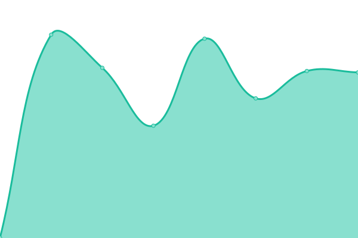

# [📈 Live Status](https://edelprino.github.io/uptime): <!--live status--> **🟧 Partial outage**

This repository contains the open-source uptime monitor and status page for [Ettore Delprino](http://edelprino.com), powered by [Upptime](https://github.com/upptime/upptime).

With [Upptime](https://upptime.js.org), you can get your own unlimited and free uptime monitor and status page, powered entirely by a GitHub repository. We use [Issues](https://github.com/edelprino/uptime/issues) as incident reports, [Actions](https://github.com/edelprino/uptime/actions) as uptime monitors, and [Pages](https://edelprino.github.io/uptime) for the status page.

<!--start: status pages-->
<!-- This summary is generated by Upptime (https://github.com/upptime/upptime) -->
<!-- Do not edit this manually, your changes will be overwritten -->
<!-- prettier-ignore -->
| URL | Status | History | Response Time | Uptime |
| --- | ------ | ------- | ------------- | ------ |
|  [Ettore Delprino](https://edelprino.com) | 🟩 Up | [ettore-delprino.yml](https://github.com/edelprino/uptime/commits/HEAD/history/ettore-delprino.yml) | 

 467ms
     
 | 

<a href="https://uptime.edelprino.com/history/ettore-delprino">100.00%</a>
    

|  [Zena Climbing](https://www.zenaclimbing.com) | 🟥 Down | [zena-climbing.yml](https://github.com/edelprino/uptime/commits/HEAD/history/zena-climbing.yml) | 

 920ms
     
 | 

<a href="https://uptime.edelprino.com/history/zena-climbing">97.26%</a>
    

|  [Climbing Land](https://www.climbing.land) | 🟥 Down | [climbing-land.yml](https://github.com/edelprino/uptime/commits/HEAD/history/climbing-land.yml) | 

 2424ms
     
 | 

<a href="https://uptime.edelprino.com/history/climbing-land">97.37%</a>
    

|  [Find Your Crag](https://findyourcrag.com) | 🟩 Up | [find-your-crag.yml](https://github.com/edelprino/uptime/commits/HEAD/history/find-your-crag.yml) | 

 420ms
     
 | 

<a href="https://uptime.edelprino.com/history/find-your-crag">100.00%</a>
    

<!--end: status pages-->

[**Visit our status website →**](https://edelprino.github.io/uptime)

## 📄 License

- Powered by: [Upptime](https://github.com/upptime/upptime)
- Code: [MIT](./LICENSE) © [Anand Chowdhary](https://anandchowdhary.com), supported by [Pabio](https://pabio.com)
- Data in the `./history` directory: [Open Database License](https://opendatacommons.org/licenses/odbl/1-0/)
